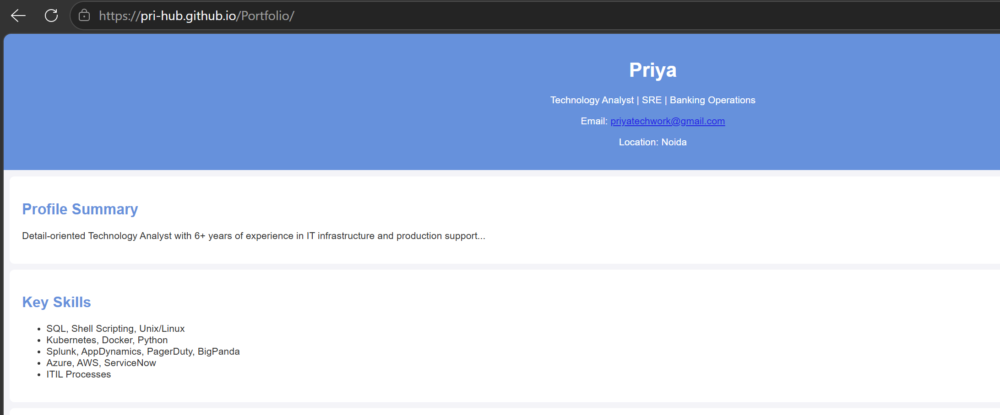

📂 Portfolio Website
A personal portfolio site showcasing my work in Technology Analysis, SRE, IT Operations, and Banking Operations.
Built with HTML, CSS, and JavaScript, and deployed automatically using GitHub Actions CI/CD → GitHub Pages.

# Portfolio

# Portfolio Website

🚀 Features
Responsive design for desktop and mobile

Clean structure with index.html, style.css, and script.js

Automated deployment via GitHub Actions workflow

Hosted live at: 👉 https://Pri-hub.github.io/Portfolio/

⚙️ CI/CD Workflow
This project uses GitHub Actions to deploy on every push to main.

Checkout code → actions/checkout@v4

Configure Pages → actions/configure-pages@v5

Upload artifact → actions/upload-pages-artifact@v4

Deploy site → actions/deploy-pages@v4

📸 Preview site

🛠️ Tech Stack
Frontend: HTML, CSS, JavaScript

CI/CD: GitHub Actions

Hosting: GitHub Pages

📬 Connect
LinkedIn: linkedin.com/in/priyase
Email: priyatechwork@gmail.com